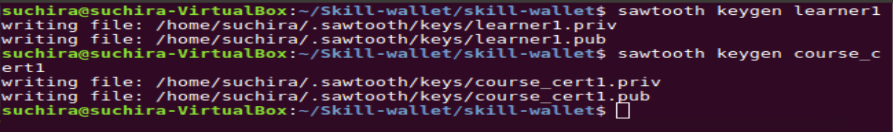

# SkillWallet
SkillWallet implementation using Hyperledger Sawtooth blockchain platform.

## Command to compile .protos files
**General command:** ```protoc --proto_path=<src> --python_out=<dest> <src/file.proto>```
```bash
cd skill-wallet
protoc --proto_path=. --python_out=. protobuf/file.proto
```
## Commands to run Sawtooth Processes in dev environment
```bash
sudo -u sawtooth sawtooth-validator -vv
sudo -u sawtooth devmode-engine-rust -v --connect tcp://localhost:5050
sudo -u sawtooth sawtooth-rest-api -v
sudo -u sawtooth settings-tp -v
```

## Commands to run Skill-wallet application Processes
Change directory to the project folder using `cd <project-folder-name>` command
```bash
sudo ./tfprocessor/digitalid_tp.py \
        --url [-l] rest-api-url \
        --connect [-C] validator-url [-v/-vv/-vvv]

sudo ./certifier/certifier_events_cli.py \
        --url [-l] rest-api-url \
        --connect [-C] validator-url \
        -u [--user] certifier-name

sudo ./learner/learner_events_cli.py \
        --url [-l] rest-api-url \
        --connect [-C] validator-url \
        -u [--user] user-name

sudo ./learner/learnerwallet.py [skill_wallet, register, register_skill, display] \
        --user [-u] user 
        --url [-l] rest-api-url

sudo ./certifier/certifier_wallet.py [certifier_wallet, attest_skill [-t] request_transaction_id] \
        --user [-u] user \
        --url [-l] rest-api-url \ 
        [-v/-vv/-vvv]
```                                    
## Screenshots
<p align="middle">
 
</p>
<p align="middle">
 
</p>
<p align="middle">
 
</p>
<p align="middle">
 
</p>
<p align="middle">
 
</p>
<p align="middle">
 
</p>
<p align="middle">
 
</p>
<p align="middle">
 
</p>
<p align="middle">
 
</p>
<p align="middle">
 
</p>
<p align="middle">
 
</p>
<p align="middle">
 
</p>
